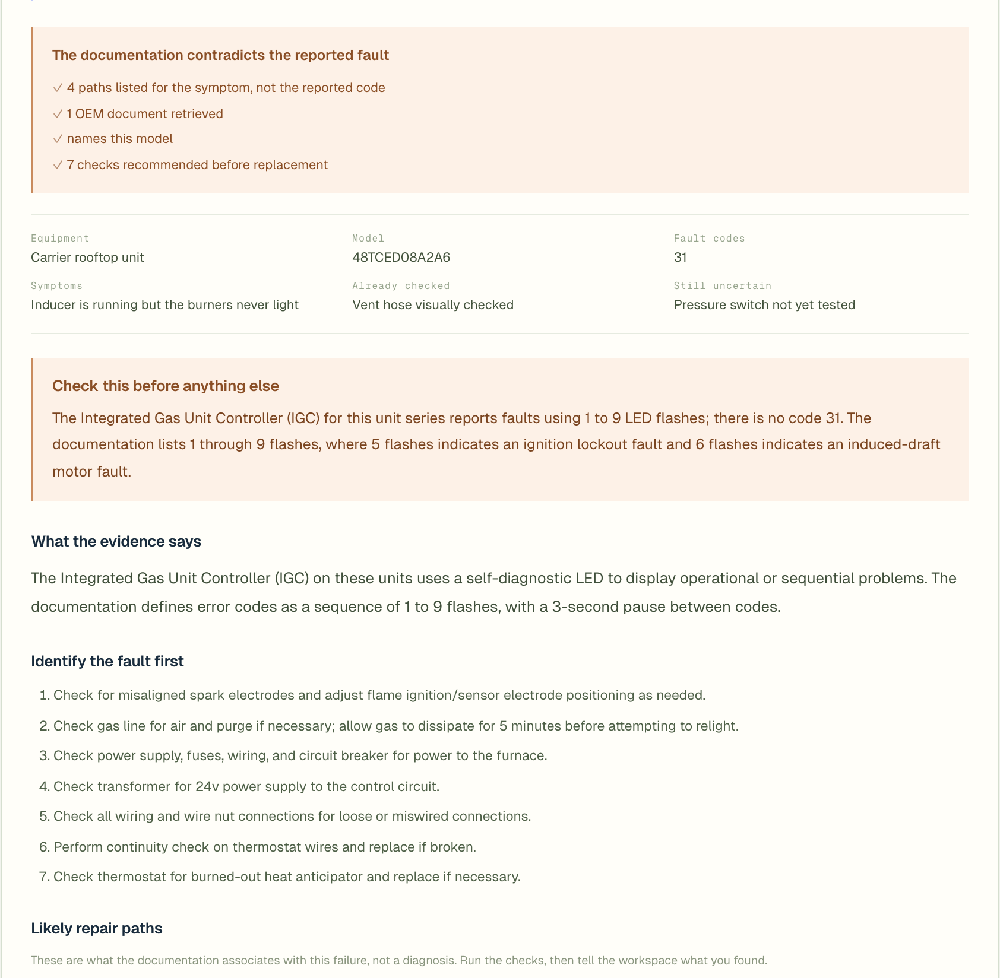

# FieldQuote

An Exa-powered parts-intelligence layer for field service. A technician's inspection note becomes verified replacement parts, live supplier prices, and a quote-ready estimate.

**Live:** [fsm-quote.vercel.app](https://fsm-quote.vercel.app)



Above: three reported faults resolved into two orderable parts. The closet's worn diaphragm and cracked vacuum breaker sleeve collapse into a single Sloan A-1101-A kit, because the kit's own contents list (quoted from the page Exa retrieved) already includes the vacuum breaker repair kit. The second line item would have been a wasted order. The panel on the right shows every Exa call the run made.

## Chosen market

Field Service Management and MRO parts procurement: plumbing, HVAC, electrical and similar maintenance trades.

**Enterprise customer:** commercial field-service companies, multi-trade maintenance operators, facilities-service providers.

**End user:** the field technician or service estimator. Today they inspect equipment, record a note, then later replay it, identify parts, search supplier sites, verify compatibility, copy prices, and hand-build a quote. FieldQuote automates that post-inspection research.

## Where Exa is used

The note is parsed into reported items first. Each item is then routed to one of four destinations, and the workspace shows which:

- **Exact part request.** The note names the replacement number, so the item goes straight to pricing.
- **Resolved before.** A registry of past conclusions answers it, and it goes straight to pricing.
- **Named tool.** The technician knows what they need, so Exa looks for a purchasable model rather than diagnosing a fault.
- **Uncertain description.** Exa researches it against manufacturer and distributor pages first.

Exa does the work at two of those steps:

1. **Identify the part.** `POST /search` with `systemPrompt` and `outputSchema`. Exa reads manufacturer and distributor pages and returns the orderable part, its contents, and a quote proving the fit. This is where messy field language ("diaphragm looks worn, vacuum breaker sleeve cracked") becomes one part number.
2. **Price the part.** `POST /search` with `category: "product"`, then `POST /contents` with a structured schema, returning current supplier listings, price evidence, SKU, pack size, availability and product images.

Quote arithmetic is deterministic and never delegated to a model. The local model never names a product; it decides what to ask.

## What is verified before you see it

Nothing reaches the estimate on the model's word alone:

- **Evidence must be on the page.** A candidate is kept only when a substantial run of its supporting quote appears word for word on a page Exa actually retrieved, and that same page carries the part number. A quote assembled from two pages fails both checks. Spec sheets arrive as PDF tables, so the match tolerates the spacing they introduce.
- **The equipment must exist.** If the retrieved pages never mention the equipment the technician named, no part is resolved. The app asks for the equipment model or part number instead of substituting a similar product's kit.
- **Prices must be corroborated.** A price appears only when the page identifies itself as the requested part, the amount is present in both the extraction's quote and the page text, and the currency is supported. Otherwise the row says what the page did show and why it was not accepted.
- **Ambiguity is surfaced, not guessed.** Where variants differ only by flow rate or voltage and the note does not say which, the app asks rather than picking one.
- **Requirements survive rewording.** A note reading "120 V" and a page reading "120 volts" are one requirement, and a requirement the page never states becomes a check on the row rather than disappearing.
- **What is not covered is written down.** Reported work the estimate does not price is listed on the estimate with its reason, rather than being left off silently.

Toggle **Exa** off in the workspace header to see the same job with every Exa contribution withheld: the technician's words, no part number, no supplier, no price.

## Structure

A single Next.js app. The Exa work runs in route handlers, which deploy as serverless functions, so there is no separate backend to run.

- `app/api/quote-stream` runs the whole job and streams each stage back: note to faults, faults to parts with Exa, parts to priced supplier options.
- `app/api/source` re-prices a single resolved part when you retry one candidate.
- `app/api/transcribe` turns a recording or a microphone take into a note.
- `app/api/parse` parses a note on its own. Nothing in the app calls it.
- `lib/` holds the trade packs, quote maths, verification helpers, and server-only provider calls.

## Run it

```bash
cp .env.example .env.local
```

Fill in `EXA_API_KEY`, `LIVEKIT_API_KEY` and `LIVEKIT_API_SECRET`, then:

```bash
npm install && npm run dev
```

Keys are read from the environment server-side and never reach the browser.

## Deploy

Deploys to Vercel with no configuration. Import the repository, then set `EXA_API_KEY`, `LIVEKIT_API_KEY` and `LIVEKIT_API_SECRET` in the project's environment variables. `FIELDQUOTE_MODEL` is optional and selects the note-parsing model.

The API routes have no authentication or rate limiting. They call paid services, so put deployment protection in front of them before sharing a URL.
